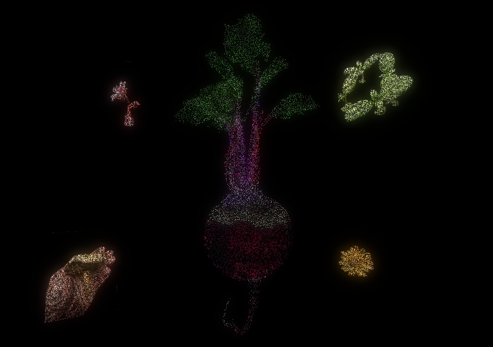

# EatBitz 3D - Key Ingredient Visualization

A visual experience that brings the farm to your plate. EatBitz 3D showcases the key ingredients used in dishes served at Venn. This visualization goes alongside a tarot card deck featuring the ingredients.



## How It Works

0. **Key ingredients** - The key ingredients are selected and rendered in 3D in the style of the tarot cards.
1. **Farm Workshops** - Visitors or farmers capture image of species found in the farms.
2. **Background Removal** - Automated AI extraction isolates the subject frmo the background.
3. **Image processing** - Using custom shaders and particle systems, we portray a point cloud aesthetic to match the 3D visuals

## Technology Stack

- **Engine**: [Godot Engine](https://godotengine.org/) 3D rendering
- **Frontend**: WebGL/HTML5 Export for browser-based navigation
- **Deployment**: Docker + Nginx for easy deployment

## Getting Started

```bash
docker-compose up
```

The application will be available at `http://localhost`

## Project Structure

- `godot/point_cloud/` - Main Godot project
- `godot/point_cloud/Scenes/` - 3D scenes and visualizations
- `godot/point_cloud/Shaders/` - Custom GDShaders for effects
- `godot/point_cloud/Assets/` - 3D models and textures
- `build/webgl/` - WebGL export for browser deployment
