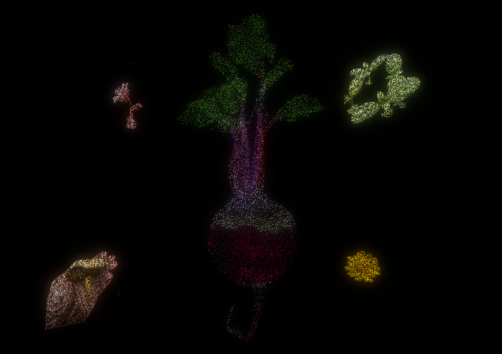

# EAT.BITZ - Ingrediennt and biodiversity visualization

https://eat.bitz.tools/venn/

eat.bitz is a 360-degree datascape of roughly 200 species found on farms that supply Venn. The nine *key ingredient  species* are displayed as larger 3D objects in the space, while companion species orbit around these ingredients. When clicking on a species, ingredient or companion, a panel opens with the field picture and species information.



## Platform Overview

- **Engine runtime:** Godot 4.6 project exported to Web
- **Public entrypoint:** `eat.bitz.tools/venn/`
- **Companion data:** tow hundred handpicked images from field workshops and provided by farmers
- **On-demand processing:** background removal service using Grounded DINO + SAM2
- **Totem:** dedicated 3D printed visualizer using an iphone for 360 video playback

## Web App Controls

The primary interactive scene uses the Basic FPS Player and a raycast-based selector:

- **Look around:** mouse move (desktop), drag/touch (mobile), physically move the device (totem)
- **Inspect a species:** left click while an ingredient/companion is highlighted

## Cherry-Picked Companion Images

Companion species are intentionally curated, not randomly sampled.

In `godot/Scripts/companions.gd`, each quest UUID maps to a hand-picked list of species image indices:

- key: quest ID (UUID)
- value: array of image indices (species positions in that quest history)

## Background Removal Pipeline (Modal)

The companion image pipeline uses a two-stage segmentation architecture:

1. **Modal inference endpoint** (`remove_bg_pipeline/segment_api.py`)
	- runs Grounding DINO + SAM2 for text-prompted detection and mask segmentation
    
2. **Local FastAPI service** (`remove_bg_pipeline/app.py`)
	- endpoint: `GET /rembg/{quest_id}/{species_id}`
	- fetches species metadata + image from the BITZ API
	- sends image to Modal endpoint
	- stores masked PNG in SQLite cache (`/var/lib/bitz-cache/bitz_cache.db`)
	- serves cached image on repeat requests for speed and cost control

In deployment, this service is available through the gateway at `/rembg/` (eg: eat.bitz.tools/rembg).

## iOS Kiosk App (Restaurant Final Product)

The in-restaurant kiosk experience is the iOS app under `ios_kiosk_app/BitzoneApp`.

Core behavior:

- loads and render the 360 video as a 3D sphere
- uses gyroscope/device motion to drive view orientation
- idle handling to save battery life

The app checks a remote manifest (`eatbitz.json`) and reads metadata fields:

- `video_url`: source MP4 location
- `hash` or `version`: change detection
- `fov`: camera field-of-view override

When hash/version changes, it downloads and replaces the local video and hot-reloads playback.

## Docker Deployment with Godot Web Export

The deployment stack is containerized with Docker Compose:

- `eatbitz3d`: builds Godot project and exports Web release in a multi-stage Dockerfile (`godot/Dockerfile`)
- `rembg`: FastAPI background-removal service (`remove_bg_pipeline/Dockerfile`)
- `venn_static`: static files server for kiosk/video assets
- `gateway`: Nginx reverse proxy routing:
  - `/venn/` -> Godot web app
  - `/rembg/` -> background-removal API
  - `/venn/video/` -> static video/manifest content

Start locally:

```bash
docker compose up --build
```

If port 8888 is busy:

```bash
EATBITZ_GATEWAY_PORT=8080 docker compose up --build
```

Then open: `http://localhost:8888/venn/`

## GitHub Actions CI/CD

Automated deployment is configured in `.github/workflows/deploy.yaml`.

On every push to `main` (or manual dispatch), the workflow:

1. checks out the repository
2. configures SSH via GitHub secrets
3. `rsync`s project files to the VPS
4. runs remote Docker deployment (`docker compose down`, prune, `up --build -d`)

This keeps web, rembg, and static services in sync from the main branch.

## Repository Highlights

- `godot/` - Godot 4.6 source project and export configuration
- `godot/Scripts/companions.gd` - curated companion image index mapping
- `godot/Scenes/3D_scene/` - companion spawner and species scene logic
- `remove_bg_pipeline/` - Modal + FastAPI background-removal pipeline
- `ios_kiosk_app/` - iOS kiosk player used in the restaurant
- `docker-compose.yml` - full runtime topology
- `gateway.nginx.conf` - routing for `/venn`, `/rembg`, `/venn/video`
- `.github/workflows/deploy.yaml` - CI/CD deployment workflow
